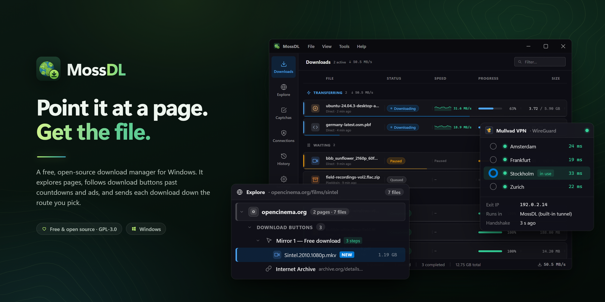
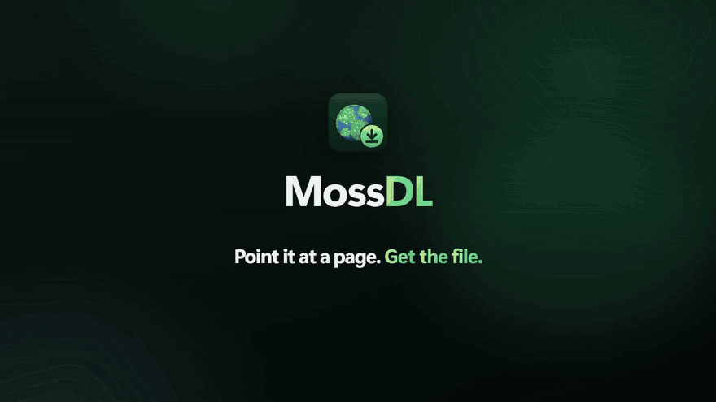
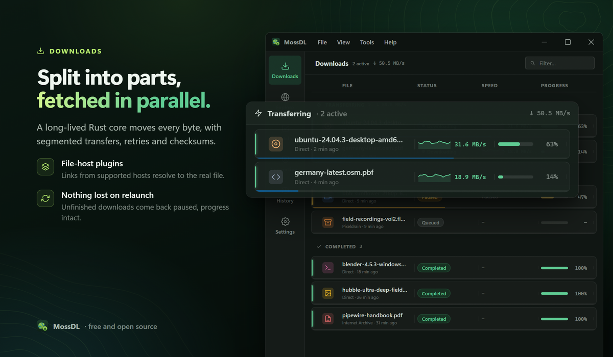
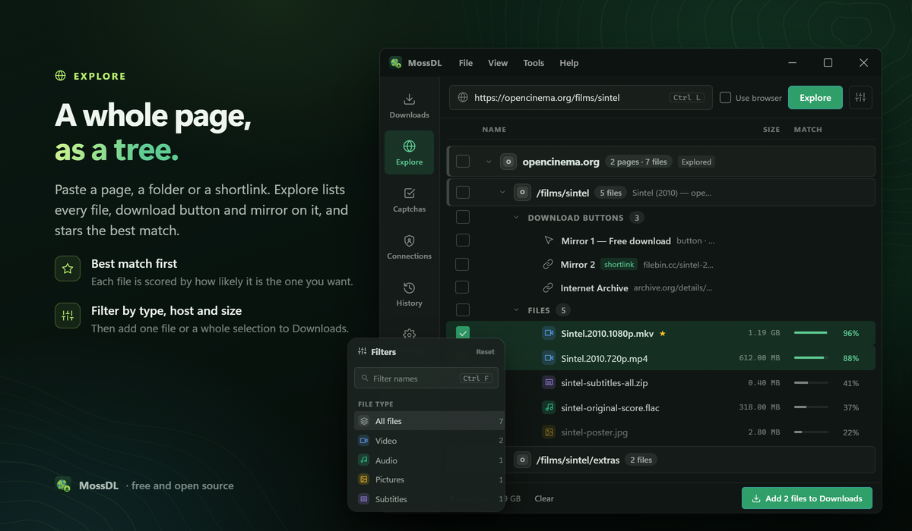
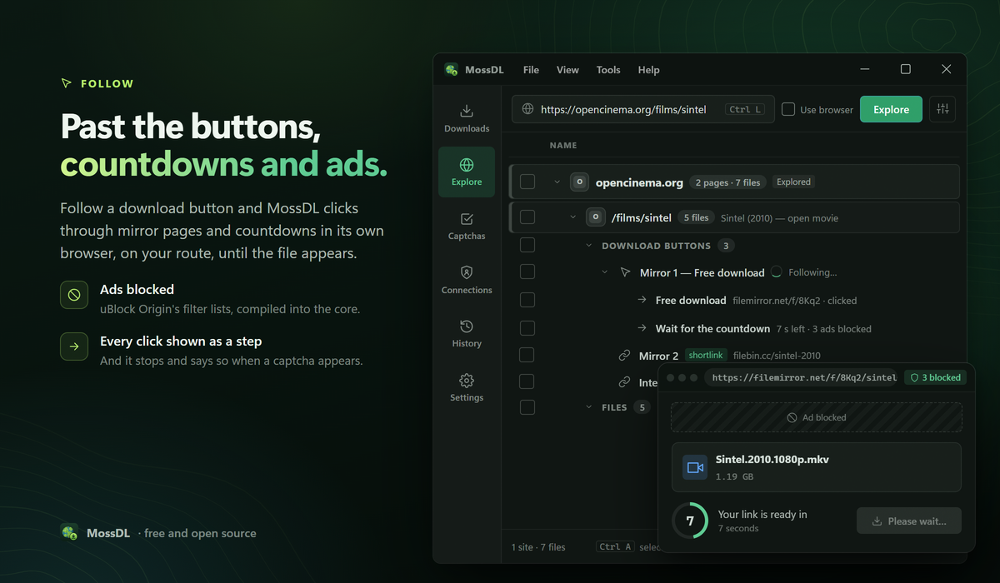
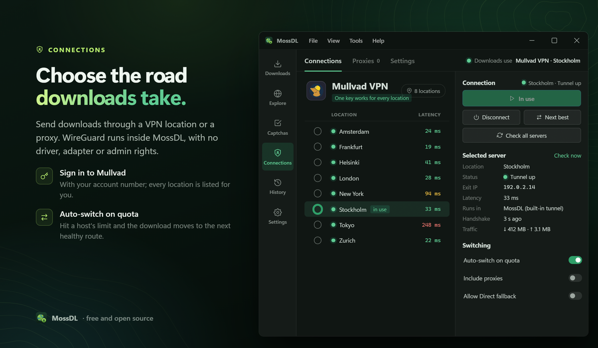
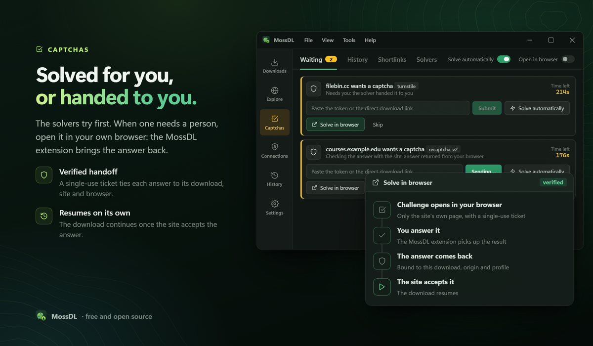

<div align="center">

<a href="https://github.com/alecvs3/MossDL">
  
</a>

<h1>MossDL</h1>

<p><strong>A download manager that finds the file behind the page, and fetches it on the connection you choose.</strong></p>

<p>
  <a href="https://github.com/alecvs3/MossDL/releases/latest"><strong>Download for Windows</strong></a> ·
  <a href="#browser-extension">Browser extension</a> ·
  <a href="#privacy">Privacy</a> ·
  <a href="#building-from-source">Build from source</a>
</p>

<p>
  <a href="https://github.com/alecvs3/MossDL/releases/latest"></a>
  <a href="LICENSE"></a>
  
  <a href="https://github.com/alecvs3/MossDL/actions/workflows/ci.yml"></a>
</p>

<picture>
  <source media="(prefers-color-scheme: dark)" srcset="docs/brand/hero-dark.png">
  <source media="(prefers-color-scheme: light)" srcset="docs/brand/hero-light.png">
  
</picture>

</div>

> [!NOTE]
> MossDL is early software (version 0.1). Windows installers are not code-signed yet, so Windows SmartScreen will warn you the first time you run one. See [Install](#install).

## Why MossDL

Most download managers start from a direct link. On file hosts you rarely have one: there is a post, a mirror page, a "free download" button, a countdown and sometimes a captcha before the file itself. MossDL handles those steps for you. It reads the page, blocks the ads, waits out the timer, asks you when a human is actually needed, and then downloads the file over several connections at once.

It also lets you choose which connection each download uses. A WireGuard location, a Mullvad city, a proxy or your normal connection can each carry a download, and they run side by side inside the app. Nothing needs to be installed system-wide and no admin rights are required.

## Contents

- [See it work](#see-it-work)
- [Features](#features)
- [Install](#install)
- [Browser extension](#browser-extension)
- [Privacy](#privacy)
- [How MossDL compares](#how-mossdl-compares)
- [Building from source](#building-from-source)
- [Contributing](#contributing)
- [Requesting a site](#requesting-a-site)
- [Acknowledgements](#acknowledgements)
- [License](#license)

## See it work

<p align="center">
  <picture>
    <source media="(prefers-color-scheme: dark)" srcset="docs/brand/demo-dark.gif">
    <source media="(prefers-color-scheme: light)" srcset="docs/brand/demo-light.gif">
    
  </picture>
</p>

<p align="center"><a href="docs/brand/demo.mp4">Watch the full demo with sound (MP4)</a></p>

## Features

### Download faster and more reliably
- **Segmented downloads.** Each file is split across several connections (8 by default, up to 32) by a Rust transfer core that reuses connections between files from the same host.
- **Pause, resume, survive a restart.** Progress is checkpointed, so an interrupted download picks up where it stopped instead of starting over. Unfinished downloads can resume automatically when the app starts.
- **Checked files.** Every download is hashed with SHA-256, and files are verified against the MD5 or SHA-1 checksums that hosts publish.
- **Your limits.** Set a global speed cap, the number of downloads running at once, retries and timeouts.

### Get past the pages in front of the file
- **Explore.** Paste a link or a whole page. MossDL works out whether it is a file, a file-host folder, a shortened link or a page full of links, and shows everything it found in one sortable tree for you to pick from.
- **About 80 provider plugins** for file hosts, cloud drives and media sites (MEGA, Google Drive, Dropbox, OneDrive, MediaFire, pixeldrain, Gofile, 1fichier, WeTransfer, Internet Archive and more), plus generic handlers for ordinary web pages and unencrypted HLS/DASH streams.
- **Follows download buttons.** On multi-page hosts, MossDL clicks through mirror pages, "free download" buttons and countdowns in a separate browser it controls, and stops as soon as the server hands over a file. Every skipped button is logged with the reason.
- **Short links unwrapped** before you download, where possible.
- **MEGA and Transfer.it** links are decrypted in the transfer core.

### Block the ads on the way
- **uBlock Origin's filter lists** (EasyList, EasyPrivacy, uBlock filters and badware, Peter Lowe's list), compiled by Brave's ad-block engine inside the transfer core. Ad links never become download candidates, and ads are hidden in the browser MossDL drives.
- **Works offline from the first run.** A built-in ad-domain list is used until the full lists are fetched; they refresh weekly.

### Choose the connection for each download
- **WireGuard inside the app.** Import a `.conf` and MossDL runs the tunnel itself. There is no WireGuard client or driver to install, you don't need admin rights, and several locations can be active at once.
- **Sign in to Mullvad** with your account number. Every Mullvad city becomes a location you can pick, using a single device key.
- **HTTP and SOCKS5 proxies**, plus detection of a system-wide VPN you already use.
- **Nothing goes out the wrong way.** Page crawls, link resolving and icon fetches use the selected connection too. If that connection can't carry a request, the request fails instead of silently going out on your normal connection.
- **Hit a download quota?** MossDL can switch to the next healthy connection. You decide whether proxies, or your direct connection, are allowed in that rotation.

### Captchas, handled or handed back
- **Off until you turn it on.** Automatic captcha solving needs your explicit opt-in in Settings.
- **Solvers in order:** local OCR for image captchas, an optional audio solver, [FlareSolverr](https://github.com/FlareSolverr/FlareSolverr) if you run it, or a 2Captcha / Anti-Captcha key of your own.
- **Finish it in your own browser.** When a person is needed, MossDL opens the real page in your browser. The extension returns the answer tied to that one download, with a single-use ticket the site never sees.
- **Captchas page.** See what's waiting, what was solved before, and which solvers are available.

### Unpack what you downloaded
- **Archives are extracted** in a separate sandboxed worker (ZIP, 7z, TAR and gzip). Output goes to a staging folder first and is only moved into place once extraction succeeds.
- **RAR** is extracted with your own [7-Zip](https://www.7-zip.org/) if it is installed. No RAR code ships with MossDL.

### A desktop app that behaves like one
- Native Windows 11 look with Mica, five themes (Midnight, Graphite, Indigo, Evergreen and Daylight) or Match Windows, adjustable interface scale and row density.
- Tray icon, launch on startup, notifications with sounds, rebindable keyboard shortcuts, an optional clipboard watcher, and a History page that keeps finished downloads across restarts.

<p align="center">





</p>

## Install

**Windows 10 or 11 (64-bit).** macOS and Linux builds are not available yet.

1. Download the latest `MossDL_<version>_x64-setup.exe` (or the `.msi`) from [GitHub Releases](https://github.com/alecvs3/MossDL/releases/latest).
2. Run it. The installer is per-user and does not need admin rights.
3. Optional: install the [browser extension](#browser-extension), and [7-Zip](https://www.7-zip.org/) if you download RAR archives.

> [!IMPORTANT]
> **The installers are not code-signed yet.** Windows SmartScreen will show "Windows protected your PC". Choose **More info → Run anyway** only if you downloaded the file from this repository's Releases page. Free code signing through the [SignPath Foundation](https://signpath.org) has been applied for; once it is approved, releases will be signed and this note will be removed.
### Code signing policy

Free code signing provided by [SignPath.io](https://about.signpath.io), certificate by [SignPath Foundation](https://signpath.org) (application pending). Roles, what gets signed and how: [code signing policy](docs/CODE_SIGNING_POLICY.md). Privacy: [privacy policy](docs/PRIVACY.md).

**Updates.** Settings → Updates checks for a new version only when you click it.

## Browser extension

**MossDL Capture** sends downloads from your browser to the app. It works in Chrome, Edge and Firefox.

- Right-click any link, a text selection, or the page: *Download with MossDL*, *Capture All Links on Page*, *Capture Page Media / Video*.
- Optionally takes over downloads the browser starts, spots HLS/DASH streams, and strips tracking parameters from links.
- *Sync session* shares one site's cookies with MossDL, so the app can download from that site as you are signed in there.
- Finishes captchas that MossDL hands to your browser (see [Captchas](#captchas-handled-or-handed-back)).

The extension talks only to the MossDL app on your computer, over the browser's native messaging. It does not contact any other server.

Until it is listed in the stores, install it from the app: **Settings → Browser extension**, or from source with `npm run browser:install`.

## Privacy

MossDL has **no analytics, no crash reporting and no accounts**. Its logs are written to your own disk, with passwords, cookies, tokens and signed URLs removed before anything is recorded.

Apart from the downloads you ask for, this is every host MossDL contacts on its own, and when:

| When | Host | Why | Turn it off |
|---|---|---|---|
| Weekly, on your selected connection | `easylist.to`, `ublockorigin.github.io`, `pgl.yoyo.org` | Refresh the ad-blocking filter lists (about 4 MB) | Settings → **Full filter lists** (the built-in list is used instead) |
| When a site is shown in the list | That site itself | Fetch its icon. No third-party icon service is used. | n/a |
| When you sign in to Mullvad | `api.mullvad.net` | Register a device key and fetch the list of relays | Don't sign in |
| When you install the solver browser | `api.github.com` (Clearcote releases) | Download the browser used for Explore and captchas | Don't install it |
| When you click "Check for updates" | Update feed | Check for a newer version | Don't click it |
| Only if you enable automatic captcha solving **and** the audio solver | `api.wit.ai` | Speech-to-text for audio captchas: the captcha's audio clip is sent | Settings → Captcha → **Audio solver / speech-to-text** |
| Only if you enter your own API key | `2captcha.com` / `api.anti-captcha.com` | Paid captcha solving | Leave the key empty |

**Connections and leaks.** Every request MossDL makes goes out on the connection you selected, including page crawls, link resolving and icon fetches. If that connection is down, the request fails instead of going out on your normal connection. The one exception is quota rotation: by default, when a host's download quota is reached, MossDL may move that download to another healthy connection, **including your direct one**. If you depend on a VPN, turn off **Connections → Settings → Allow falling back to Direct**.

**Secrets.** Mullvad account numbers, WireGuard keys, proxy passwords and API keys are kept in the Windows Credential Manager, not in plain-text settings.

The full [privacy policy](docs/PRIVACY.md) says the same, for the app and the browser extension.

## How MossDL compares

MossDL isn't the right tool for everything.

**Pick something else if:**
- **You need torrents or magnet links.** MossDL doesn't support them. Use [qBittorrent](https://github.com/qbittorrent/qBittorrent).
- **You're on macOS or Linux.** MossDL is Windows-only for now. [AB Download Manager](https://github.com/amir1376/ab-download-manager) and [Motrix](https://github.com/agalwood/Motrix) run there.
- **You want a command-line tool for video sites.** [yt-dlp](https://github.com/yt-dlp/yt-dlp) supports thousands of sites and is scriptable.
- **You need DRM-protected or encrypted streams.** MossDL deliberately doesn't handle them.

### Benchmarks

A like-for-like benchmark against JDownloader 2, Internet Download Manager, Free Download Manager, AB Download Manager and Motrix is being prepared. The method is in [docs/benchmarks/METHODOLOGY.md](docs/benchmarks/METHODOLOGY.md); results will be published with their raw data, not before.

## Building from source

MossDL has three parts: a **Tauri** desktop shell with a React UI (`src-tauri/`, `src/`), a **Python** engine that does the resolving, queueing and captchas (`engine/`, `plugins/`), and a **Rust** transfer core that does the downloading, tunnels and ad blocking (`src-tauri/src/bin/transfer-core.rs`).

**Prerequisites (Windows):**
- [Node.js](https://nodejs.org/) 22.6 or newer (the UI tests use `--experimental-strip-types`)
- [Rust](https://rustup.rs/) stable with the MSVC toolchain, plus the [Tauri prerequisites](https://v2.tauri.app/start/prerequisites/) (Visual Studio C++ Build Tools and WebView2, which Windows 11 already includes)
- [Python](https://www.python.org/) 3, available on `PATH` as `python`

```powershell
git clone https://github.com/alecvs3/MossDL.git
cd MossDL
npm install
python -m pip install -r requirements.txt

# The transfer core and archive worker are separate binaries
cargo build --manifest-path src-tauri/Cargo.toml --bin transfer-core --bin archive-worker

# Run the app with hot reload
npm run tauri dev
```

Optional engine extras: `patchright` (drives the browser that Explore and the captcha solvers use) and `ddddocr` (local OCR for image captchas).

**Before you open a pull request**, run the quick quality gate. It type-checks and builds the UI, runs the Python, UI and Rust tests, and runs the duplication and dead-code checks:

```powershell
python scripts/check_all.py --profile fast
```

**Release builds** (installers, packaged extensions, update metadata): `scripts/release.ps1`. The header of that script lists the optional signing and update environment variables.

## Contributing

Bug reports, fixes and new site plugins are welcome.

- Read [CONTRIBUTING.md](CONTRIBUTING.md) and keep changes small and focused.
- `python scripts/check_all.py --profile fast` must pass with zero errors.
- Open an [issue](https://github.com/alecvs3/MossDL/issues/new/choose) before starting on large changes.
- Security problems: please report them privately as described in [SECURITY.md](SECURITY.md), not in a public issue.

## Requesting a site

If a site doesn't work, [request a plugin](https://github.com/alecvs3/MossDL/issues/new?template=plugin_request.yml) and include an example link and what happens now.

To write one yourself, most sites need only a declarative `recipe.jsonc` and no code. Start with

```powershell
python -m engine.cli plugin scaffold example-host --host example.com
python -m engine.cli plugin test example-host
```

and read the [plugin SDK](PLUGIN_SDK.md). Plugins run in separate processes, only reach the hosts their manifest declares, and never choose where files are written.

## Acknowledgements

MossDL is built on the work of these projects:

- [Tauri](https://tauri.app/), the desktop shell and updater, with [React](https://react.dev/), [Vite](https://vite.dev/), [TypeScript](https://www.typescriptlang.org/) and [Tailwind CSS](https://tailwindcss.com/)
- [Tokio](https://tokio.rs/) and [reqwest](https://github.com/seanmonstar/reqwest), which run the transfer core's async networking
- [boringtun](https://github.com/cloudflare/boringtun) (WireGuard protocol) and [smoltcp](https://github.com/smoltcp-rs/smoltcp) (TCP/IP stack) for the in-app tunnels
- [adblock-rust](https://github.com/brave/adblock-rust) by Brave, running the filter lists from [uBlock Origin](https://github.com/gorhill/uBlock) / [uAssets](https://github.com/uBlockOrigin/uAssets), [EasyList and EasyPrivacy](https://easylist.to/) and [Peter Lowe's list](https://pgl.yoyo.org/adservers/)
- [sevenz-rust2](https://github.com/hasenbanck/sevenz-rust2), [zip](https://github.com/zip-rs/zip2), [tar-rs](https://github.com/alexcrichton/tar-rs) and [flate2](https://github.com/rust-lang/flate2-rs) for archives, and [7-Zip](https://www.7-zip.org/) (yours, for RAR)
- [RustCrypto](https://github.com/RustCrypto) (SHA-2, SHA-1, MD5, AES) and [PyCryptodome](https://www.pycryptodome.org/) for checksums, MEGA decryption and WireGuard keys
- [HTTPX](https://www.python-httpx.org/), [PySocks](https://github.com/Anorov/PySocks) and [keyring](https://github.com/jaraco/keyring) in the Python engine
- [Patchright](https://github.com/Kaliiiiiiiiii-Vinyzu/patchright) and the [Clearcote](https://github.com/clearcotelabs/clearcote-browser) browser, [ddddocr](https://github.com/sml2h3/ddddocr) and [FlareSolverr](https://github.com/FlareSolverr/FlareSolverr) for captchas
- [Buster](https://github.com/dessant/buster), whose approach the audio captcha solver follows

Full list of licences: [THIRD_PARTY_NOTICES.md](THIRD_PARTY_NOTICES.md).

## License

MossDL is free software, licensed under the [GNU General Public License v3.0 or later](LICENSE) (`GPL-3.0-or-later`).
